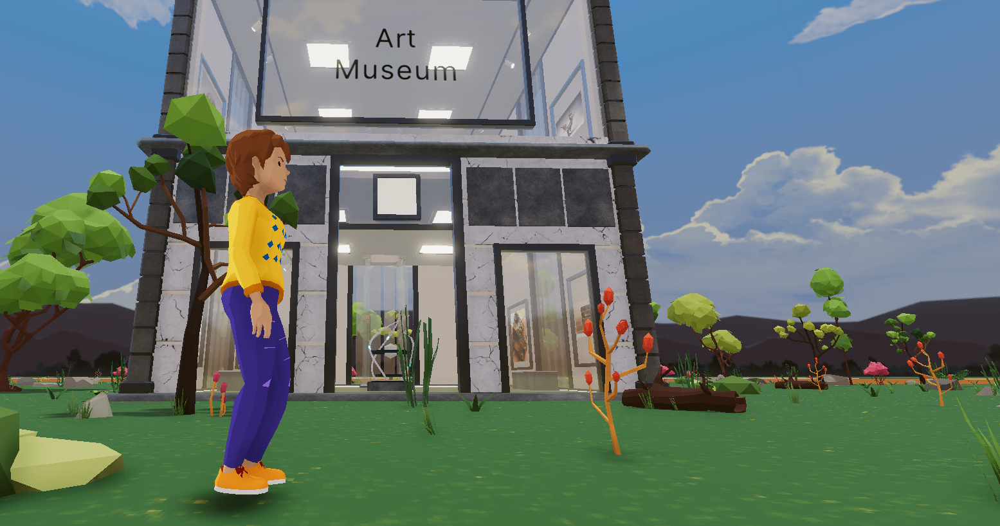

<!-- @format -->

# Art Museum

# Developers in the project<br/>

Samuel<br/>
Nashons<br/>

we are web3 and blockchain devevelopers

# Tech stack used

<ol>
 <li>Decentraland tools</li>
 <li>Optimism-goerli</li>
 <li>Alchemy provider</li>
 <li>EthersJs</li>
 <li>Nextjs</li>
 <li>Solidity and hardhat</li>
 <li>Ipfs</li>
</ol>

# Optimism Artifacts NFT Store

smart contract and client app===[Github link for art store](https://github.com/4SAMU/Museum)

# our Demo<br/>

video demo <br/>
[click here to view demo](https://www.loom.com/share/88427abe873a4952b27c50d3c67182bc)

<video src='screenshot/decentraland.mp4' width=180/>

A simple generic virtual museum for displaying NFT art



This scene allows for viewing and buying museum artifacts in form of NFTs.
Artifacts are tokenized and bought in form of NFTs deployed on optimism

## Try it out

**Install the CLI**

Download and install the Decentraland CLI by running the following command:

```bash
npm i -g decentraland
```

**Previewing the scene**

Download this example and navigate to its directory, then run:

```
$:  dcl start
```

Any dependencies are installed and then the CLI opens the scene in a new browser tab.
Learn more about how to build your own scenes in our [documentation](https://docs.decentraland.org/) site.

If something doesn’t work, please [file an issue](https://github.com/decentraland-scenes/Awesome-Repository/issues/new).

## Copyright info

This scene is protected with a standard Apache 2 licence. See the terms and conditions in the [LICENSE](/LICENSE) file.
